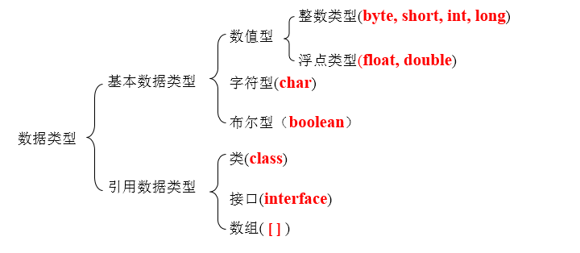

# java 基础

## java 关键字
``` bash
Abstract        // 抽象的，用在类的声明中来指明一个类是不能被实例化的，但是可以被其它类继承。一个抽象类可以使用抽象方法，抽象方法不需要实现，但是需要在子类中被实现
assert          // 用来进行程序调试
boolean         // 基本数据类型之一，布尔类型
break           // 用来改变程序执行流程，立刻从当前语句的下一句开始执行从。如果后面跟有一个标签，则从标签对应的地方开始执行
byte            // 基本数据类型之一，字节类型
case            // 用来定义一组分支选择，如果某个值和switch中给出的值一样，就会从该分支开始执行。
catch           // 用来声明当try语句块中发生运行时错误或非运行时异常时运行的一个块。
char            // 用来定义一个字符类型 
catch           // 用在异常处理中，用来捕捉异常
char            // 基本数据类型之一，字符类型
class           // 类
const           // 保留关键字，没有具体含义
continue        // 用来打断当前循环过程，从当前循环的最后重新开始执行，如果后面跟有一个标签，则从标签对应的地方开始执行。
default         // 默认，例如，用在switch语句中，表明一个默认的分支
do              // 用来声明一个循环，这个循环的结束条件可以通过while         关键字设置
double          // 用来定义一个double类型的变量
else            // 如果if语句的条件不满足就会执行该语句。
enum            // 枚举
extends         // 表明一个类型是另一个类型的子类型，这里常见的类型有类和接口
final           // 你只能定义一个实体一次，以后不能改变它或继承它。更严格的讲：一个final修饰的类不能被子类化，一个final修饰的方法不能被重写，一个final修饰的变量不能改变其初始值。
finally         // 用来执行一段代码不管在前面定义的try语句中是否有异常或运行时错误发生。
float           // 用来定义一个浮点数变量
for             // 用来声明一个循环。程序员可以指定要循环的语句，推出条件和初始化变量。
goto            // 保留关键字，没有具体含义
if              // 用来生成一个条件测试，如果条件为真，就执行if下的语句。
implements      // 在类的声明中是可选的，用来指明当前类实现的接口。
import          // 在源文件的开始部分指明后面将要引用的一个类或整个包，这样就不必在使用的时候加上包的名字。
instanceof      // 用来测试第一个参数的运行时类型是否和第二个参数兼容。
int             // 用来定义一个整形变量
interface       // 用来定义一系列的方法和常量。它可以被类实现，通过
long            // 用来定义一个long类型的变量。
native          // 用来声明一个方法是由与计算机相关的语言（如C/C++/FORTRAN语言）实现的
new             // 用来创建新实例对象
null            // 空
private         // 用在方法或变量的声中。它表示这个方法或变量只能被这个类的其它元素所访问。
protected       // 在方法和变量的声明中使用，它表示这个方法或变量只能被同一个类中的，子类中的或者同一个包中的类中的元素所访问
public          // 在方法和变量的声明中使用，它表示这个方法或变量能够被其它类中的元素访问。
return          // 用来结束一个方法的执行。它后面可以跟一个方法声明中要求的值。
short           // 用来定义一个short类型的变量。
static          // 用来定义一个变量为类变量。类只维护一个类变量的拷贝，不管该类当前有多少个实例。"static" 同样能够用来定义一个方法为类方法。类方法通过类名调用而不是特定的实例，并且只能操作类变量。 
strictfp        // 用来声明FP_strict（单精度或双精度浮点数）表达式遵循IEEE 754算术规范
super           // 表明当前对象的父类型的引用或者父类型的构造方法
switch          // 分支语句结构的引导词
synchronized    // 表明一段代码需要同步执行
this            // 用来代表它出现的类的一个实例。this可以用来访问类变量和类方法。
throw           // 允许用户抛出一个exception对象或者任何实现throwable的对象
throws          // 用在方法的声明中来说明哪些异常这个方法是不处理的，而是提交到程序的更高一层。 
transient       // 用来表示一个域不是该对象串行化的一部分。当一个对象被串行化的时候，transient型变量的值不包括在串行化的表示中，然而非transient型的变量是被包括进去的。
try             // 用来定义一个可能抛出异常语句块。如果一个异常被抛出，一个可选的catch语句块会处理try语句块中抛出的异常。同时，一个finally语句块会被执行，无论一个异常是否被抛出。 
void            // 用在Java语言的方法声明中说明这个方法没有任何返回值。"void"也可以用来表示一句没有任何功能的语句。
volatile        // 用在变量的声明中表示这个变量是被同时运行的几个线程异步修改的。 
while           // 用来定义一段反复执行的循环语句。循环的退出条件是while语句的一部分。

```

## 数据类型


